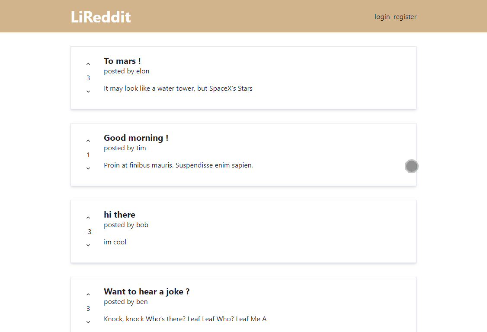

# MERNG Blog
## MERNG Stack
M(MongoDb) E(Express) R(React) N(Node) G(GraphQL)

This is a fullstack project created by Ben awad teaching : 
- React
- Next.js
- TypeScript
- GraphQL
- URQL/Apollo
- Node.js
- PostgreSQL
- MikroORM/TypeORM
- Redis
- TypeGraphQL
- Chakra

## Features 
- User 
  - register
  - login
  - forget password
- Posts
  - create 
  - display full post
  - delete 
  - edit
  - up/downvote
- UI
  - pagination

## Demo 

